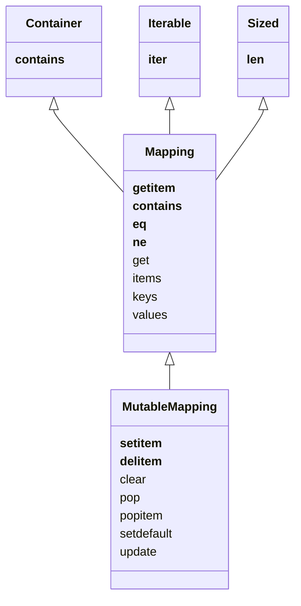

# CH3. 딕셔너리와 집합

- 파이썬의 dict 클래스 뒤에는 **해시 테이블** 이라는 엔진이 있다.
- 집합 또한 해시 테이블을 이용해서 구현되어 있다

## 3.1 일반적인 매핑형

- collections.abc 모듈은 dict 및 아와 유사한 자료형의 인터페이스를 정의하기 위해 Mapping 및 MutableMapping 추상 베이스 클래스를 제공한다



`collections.abc 모듈의 상속 관계`


### 해시 가능하다?(hashable)

- 수명 주기 동안 결코 변하지 않는 해시값을 갖고 있고, 대른 객체와 비교할 수 있으면 객체를 해시 가능하다고 한다. 동일하다고 판단되는 객체는 반드시 해시값이 동일해야 한다
- `__hash__ 메서드와 __eq__ 메서드가 필요`
- 예시로, `hash((1, 2)) == hash((1, 2)) -> True`

- 불변형 객체 (str, 수치형 등) 은 **해시가 가능하다**
  - 튜플은 불변형이지만, 내부 항목중 가변 객체가 있다면 해시 불가능하다

### Python Dict 구현의 다양한 방법

```python
a = dict(one=1, two=2, three=3)
b = {'one': 1, 'two':2, 'three': 3}
c = dict(zip(['one', 'two', 'three'], [1, 2, 3]))
d = dict([('two', 2), ('one', 1), ('three', 3)])
e = dict({'three': 3, 'one': 1, 'two': 2})

a == b == c == d == e
True
```


## 3. 2 지능형 딕셔너리 (dict comprehension)

- 리스트, 제너레이터와 같이 dict 형도 conprehension 문법을 사용할 수 있다

```python
a = [(1,1), (2,2), (3,3)]
dict1 = {key: value for key, value in a}

dict1
{1: 1, 2: 2, 3: 3}
    
b = [(1,1), (2,2), (3,3)]
dict2 = {key: str(value) for key, value in a}

dict2
{1: '1', 2: '2', 3: '3'}
```

## 3. 3 OrderedDict, DefaultDict

- collections 모듈에는 dict형의 변형인 defaultdict 와 OrderedDict 가 있다

### setdefault()

- dict 는 존재하지 않는 키 k로 d[k] 접근을 시도하면 KeyError를 발생시킨다
  - KeyError를 처리하는게 싫다면 .get(k, default) 메서드를 사용하는게 좋다


- setdefault(key, default) 를 사용하면 코드를 더 간편하게 줄일 수 있다

```python
a = {}

# a dict 에서 키 k에 매칭되는 리스트를 가져와서 value 를 추가하는 코드
# a[k] 가 아직 없을 수 있으니, get에 default 값을 주어 가져와 값을 넣고 a[k] 에 할당해준다
....
tmp = a.get(k, [])
tmp.append(value)
a[k] = tmp
...

# setdefault를 사용, 더 간편하다

...
# a[k] 가 있으면 a[k] 값을 리턴, 없으면 default를 a[k]에 세팅하고 값을 리턴
a.setdefault(k, []).append(value)
...


```


## 3.4 융통성 있게 키를 조회하는 매핑

- 검색 시 키가 존재하지 않으면 어떤 특별한 값을 반환하는 매핑이 있으면 편리할 때가 많다 이를 위해서는
  1. dict 대신 defaultdict 를 사용한다
  2. dict 등의 매핑형을 상속해서 `__missing__()` 메서드를 추가해준다


### defaultdict

- 존재하지 않는 키로 검색할 때 요청에 따라 항목을 생성한다
- 존재하지 않는 키 인수로 `__getitem__()` 메서드를 호출할 때마다 기본값을 생성하기 위해 사용되는 콜러블을 제공한다
  - 콜러블은 default_factory 라는 객체 속성에 저장된다.

```python

a = defaultdict(list)
a[1] = [1, 2]
a[2] = [3, 4]

# 콜러블은 default_factory 객체 속성에 저장된다.
a.default_factory
list

a[1]
[1, 2]

# a[3] 이 없으므로 콜러블에 default_factory에 저장되어있는 콜러블인 list 함수를 실행시켜 a[3]에 할당해준다
a[3]
[]

a
defaultdict(list, {1: [1, 2], 2: [3, 4], 3: []})
```


### `__missing__() ` 메서드

- dict 클래스를 상속하고 이 메서드를 구현해 준다면 `dict.__getitem__()` 메서드가 키를 발견할 수 없을 때 KeyError 대신 `__missing__()` 메서드를 호출한다.

```python
# 검색 시 키를 str 형으로 변환해서 검색해 준다
# 예시로 a['1'] 이나 a[1] 이 같은 매핑이 되도록 수행된다.

class StrKeyDict0(dict):
    # 키가 없다면 str(key) 로 다시 검색
    # str(key) 도 없다면 KeyError 를 일으킨다
    def __missing__(self, key):
        if isinstance(key, str):
            raise KeyError(key)
        return self[str(key)]
    
    # self[key] 를 이용해서 __missing__() 메서드를 이용할 수 있게 한다
    def get(self, key, default=None):
        try:
            return self[key]
        except KeyError:
            return default
    
    # 원래 키로 검색 후 str(key) 로도 검색
    def __contains__(self, key):
        return key in self.keys() or str(key) in self.keys()
        
```


## 3.5 그 외 매핑형

### collections.OrderedDict

- 키를 삽입한 순서대로 유지해 준다
  - popitem() 메서드는 최근에 삽입한 항목을 꺼냄
    - popitem(last=False) 를 이용하면 맨 앞의 요소를 꺼낸다.

### collections.ChainMap

- 매핑들의 목록을 담을 수 있다
- 매핑 목록들을 하나의 매핑처럼 사용할 수가 있다 (검색, popitem 등)

```python
a = {1:1}
b = {2:2}
c = {3:3}

# ChainMap 생성
chain = ChainMap(a, b, c)

# a[1] 값을 가져온다
chain[1]
1

# a[1] 값이 pop 된다
chain.popitem(1)
1

a
{}
```


### collections.Counter

- 모든 키에 정수형 카운터를 가지고 있다
- 키를 갱신해 카운터를 늘릴 수 있다
- 합계를 위한 +, - 연산자가 구현되어 있으며, n 개의 가장 많이 사용된 항목과 항목들의 카운터로 구성된 튜플의 리스트를 반환하는 most_common([n]) 메서드를 제공한다

```python
# 인자로 받은 iterable 객체의 값들을 카운팅해준다.
c = Counter('aaaabbcc')

c
Counter({'a': 4, 'b': 2, 'c': 2})

c.update('aaab')
c
Counter({'a': 7, 'b': 3, 'c': 2})

b = Counter('ccddde')

# 두 개의 카운터를 합치거나 뺄 수 있다
d = c + b
d
Counter({'a': 7, 'b': 3, 'c': 4, 'd': 3, 'e': 1})
```


## 3.6 UserDict 상속하기

- Dict 기본형을 상속하는 것 보다, UserDict를 상속해서 매핑형을 만드는 것이 좋다
  - 기본형을 상속할을 때 나타나는 재귀적 호출을들 피할 수 있으며, `__contains__()` 메서드를 간단히 구현 가능하다

```python
class StrKeyDict(collections.UserDict):
    def __missing__(self, key):
        if isinstance(key, str):
            raise KeyError(key)
        return self[str(key)]
    
    # self.data 에 dict 형으로 값들이 들어있다
    def __contains__(self, key):
        return str(key) in self.data
    
    # 키 값을 매핑할 때 키를 str 형으로 변환해서 매핑한다
    def __setitem__(self, key, item):
        self.data[str(key)] = item
        
        

# __init__() 메서드에서도 update() 메서드를 사용한다 (init 시 반복형 키,값 쌍들이나 다른 dict 형 등이 올 수 있다. 이것을 로딩하기 위해 update 사용)
# update 메서드는 self[key] = value 식의 구문을 사용하므로, 결국 구현해 준 __setitem__() 메서드를 사용하게 된다.
a = StrKeyDict([(1,'one'), ('2','two'), (3,'three')])

# key를 모두 str 형으로 변환한다
a
{'1': 'one', '2': 'two', '3': 'three'}

# 실제 값들은 a.data 에 들어있다.
a.data
{'1': 'one', '2': 'two', '3': 'three', '4': 'four'}

type(a.data)
dict
```


## 3.7 불변 매핑

- 사용자가 실수로 매핑을 변경하지 못하도록 보장하고 싶은 경우에 사용할 수 있다

```python
from types import MappingProxyType

d = {1: 'A'}
d_proxy = MappingProxyType(d)

# d_proxy를 변경할 수는 없다
d_proxy[1] = 1
---------------------------------------------------------------------------
TypeError                                 Traceback (most recent call last)
<ipython-input-190-26be05617dad> in <module>
----> 1 d_proxy[1] = 1

TypeError: 'mappingproxy' object does not support item assignment

d_proxy[1]
'A'

# d 에 대한 변경은 바로 반영된다
d[2] = 'B'
d_proxy[2]
'B'
```


## 3.8 집합 자료형

- 가변형 버전인 **set** 과 불변형 버전인 **frozenset** 이 내장형으로 구현되어 있다.
- 집합의 요소는 반드시 **hashable** 해야 한다.
  - 그러므로 set 안에는 set 요소가 들어가는게 불가능하지만, frozenset 요소가 들어가는 것은 가능하다


### 집합 리터럴

- 공집합은 반드시 a = set() 과 같이 생성해야 한다.
- 그 외는 {1, 2, 3} 처럼 생성할 수 있다

```python
# 생성자 호출보다 {1, 2, 3} 과 같은 리터럴 집합 구문을 사용하는 것이 더 빠르고, 가독성이 좋다.

dis('{1}')
  1           0 LOAD_CONST               0 (1)
              2 BUILD_SET                1
              4 RETURN_VALUE
              
dis('set([1])')
  1           0 LOAD_NAME                0 (set)
              2 LOAD_CONST               0 (1)
              4 BUILD_LIST               1
              6 CALL_FUNCTION            1
              8 RETURN_VALUE 
            
# 위 바이트코드에서 보이듯이, set([1]) 은 리스트를 생성하고, 다시 이 리스트를 생성자에 전달하는 식으로 수행된다.
```


### 지능형 집합 (set comprehension)

- 딕셔너리 컴프리헨션과 비슷하다

```python
{chr(i) for i in range(32, 256) if 'SIGN' in name(chr(i), '')}

{'#','$','%','+','<','=','>','¢','£','¤','¥','§','©','¬','®','°','±','µ','¶','×','÷'}
```


